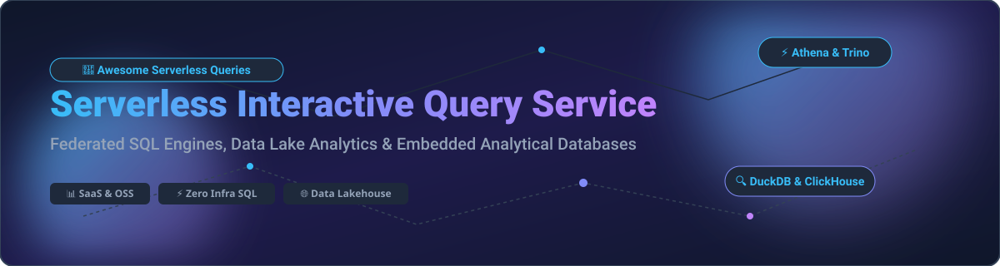

# ⚡ Awesome Serverless Interactive Query Service

  
  
  
  
  

---

## 📌 Top Serverless Interactive Query Service Ecosystem

**Curated List of SaaS Products & Open-Source GitHub Projects**  
*Focused on Federated SQL Queries, Data Lake Analytics & Self-Hosted Query Engines*  

> **SEO Keywords**: Serverless Query Engine, Federated SQL, Interactive Analytics, Data Lake SQL, Cloud Data Warehouse, Trino, Athena, ClickHouse, DuckDB, BigQuery, Spark SQL, Polars, DataFusion, Iceberg, Delta Lake.

---

## 📈 Sector Overview & Market Size

> 💡 **Market Insights**: The global Cloud Analytics & Serverless Interactive Query Market is estimated at **~$35 Billion USD** and is projected to expand at a **CAGR of 22%**. The sector is **moderately concentrated** among tech hyperscalers (Google Cloud, AWS) and major data platforms (Snowflake, Databricks), alongside specialized managed query engine vendors (Starburst, ClickHouse Cloud, Dremio).

---

## ☁️ SaaS / Hosted Platforms

Below is a comparison of leading commercial SaaS platforms offering serverless interactive query engines and cloud data warehouses, sorted by company size / valuation in descending order.

| Platform / Vendor | Description & Use Case | Specific Starting Pricing | Free Tier / Trial Limits | Company Size (Valuation / Revenue) |
| :--- | :--- | :--- | :--- | :--- |
| **[Google Cloud BigQuery](https://cloud.google.com/bigquery)** | Serverless cloud data warehouse for petabyte-scale SQL analytics with built-in ML. | **$6.25 / TB scanned** (on-demand query pricing) or $0.04 / slot-hour. | **10 GB storage + 1 TB query scanning** per month forever free. | **~$2.0 Trillion** (Alphabet Inc. Market Cap) |
| **[Amazon Athena](https://aws.amazon.com/athena/)** | AWS serverless interactive query service running SQL directly over S3 data lake files. | **$5.00 / TB scanned** (S3 query execution). | **10 GB/month scanner free** for 12 months via AWS Free Tier / $300 AWS trial credits. | **~$1.9 Trillion** (Amazon Inc. Market Cap) |
| **[Ahana Cloud for Presto](https://ahana.io/)** *(IBM watsonx.data)* | Managed Presto platform for federated SQL queries across data lakes. | **$0.40 / vCPU-hour** (starting cluster compute). | **30-day free trial** with $200 credits on IBM Cloud. | **~$180 Billion** (IBM Market Cap) |
| **[Snowflake](https://www.snowflake.com/)** | Cloud data platform with separated compute & storage, multi-cluster warehouses. | **~$2.00 / credit** (Standard Edition) + $23/TB-month storage. | **30-day free trial** with $400 worth of free credits. | **~$50 Billion** (Market Cap) |
| **[Databricks SQL](https://www.databricks.com/)** | Lakehouse SQL analytics powered by Photon engine over Delta Lake, Parquet & Iceberg. | **$0.22 - $0.70 / DBU-hour** (SQL Pro at $0.55/DBU-hr + cloud infra). | **14-day free trial** on AWS, Azure, or GCP. | **~$43 Billion** (Private Valuation) |
| **[ClickHouse Cloud](https://clickhouse.com/)** | Columnar analytical database with real-time ingestion & sub-second SQL queries. | **$0.016 / GB-mo storage** + $0.14 / GB-hr compute (min. ~$20/mo). | **30-day free trial** with $300 free credits. | **~$2.0 Billion** (Private Valuation) |
| **[Starburst Galaxy](https://www.starburst.io/)** | Fully managed Trino platform for federated data mesh queries across heterogeneous databases. | **$0.60 / vCPU-hour** (Standard cluster execution). | **Free trial with $500** in usage credits. | **~$1.2 Billion** (Private Valuation) |
| **[Dremio Cloud](https://www.dremio.com/)** | Apache Arrow-native lakehouse query engine with semantic layer. | **$0.39 / DCU-hour** (Dremio Compute Unit). | **Forever Free Tier** (up to 5 concurrent queries) + 100 free DCU credits. | **~$1.0 Billion** (Private Valuation) |

---

## 🔓 Open-Source GitHub Projects

Sorted descending by GitHub Stars_Count ⭐.

1. **[Apache Spark](https://github.com/apache/spark)**   
   Unified engine for large-scale data processing and SQL analytics over big data.

2. **[ClickHouse](https://github.com/ClickHouse/ClickHouse)**   
   High-performance open-source columnar analytical database for real-time SQL queries.

3. **[Polars](https://github.com/pola-rs/polars)**   
   Lightning-fast DataFrame library written in Rust with lazy query evaluation.

4. **[DuckDB](https://github.com/duckdb/duckdb)**   
   In-process analytical SQL database engine designed for local and embedded analytics ("SQLite for OLAP").

5. **[PrestoDB](https://github.com/prestodb/presto)**   
   Distributed SQL query engine for big data, original project initiated at Facebook.

6. **[Apache Arrow](https://github.com/apache/arrow)**   
   Development platform for in-memory analytics with language-independent columnar memory format.

7. **[Apache Doris](https://github.com/apache/doris)**   
   Real-time analytical database based on MPP architecture for fast sub-second SQL responses.

8. **[Apache Druid](https://github.com/apache/druid)**   
   High-performance real-time analytics database built for streaming and batch event data.

9. **[Trino](https://github.com/trinodb/trino)**   
   De facto open-source fast distributed SQL query engine for federated queries across 50+ data sources.

10. **[StarRocks](https://github.com/StarRocks/starrocks)**   
    Next-generation sub-second MPP analytical database for real-time lakehouse analytics.

11. **[Delta Lake](https://github.com/delta-io/delta)**   
    Open storage layer that brings ACID transactions and reliability to Apache Spark and big data workloads.

12. **[Apache Iceberg](https://github.com/apache/iceberg)**   
    High-performance open table format for huge analytical datasets supporting time travel & schema evolution.

13. **[Apache DataFusion](https://github.com/apache/datafusion)**   
    Extensible, fast, in-memory Rust SQL query engine foundation built on Apache Arrow.

14. **[Apache Pinot](https://github.com/apache/pinot)**   
    Real-time distributed OLAP datastore designed for low-latency user-facing analytics.

15. **[Apache Hive](https://github.com/apache/hive)**   
    Data warehouse software facilitating reading, writing, and managing large datasets residing in distributed storage.

16. **[Apache Hudi](https://github.com/apache/hudi)**   
    Transactional data lake platform bringing stream processing capabilities to data lakes.

17. **[Apache Calcite](https://github.com/apache/calcite)**   
    Dynamic data management framework featuring SQL parsing, optimization, and relational algebra.

18. **[Apache Impala](https://github.com/apache/impala)**   
    Native MPP SQL query engine for Apache Hadoop providing low-latency queries on HDFS & Kudu.

19. **[Apache Drill](https://github.com/apache/drill)**   
    Schema-free SQL query engine for Hadoop, NoSQL, and cloud storage systems.

20. **[Project Nessie](https://github.com/projectnessie/nessie)**   
    Transactional catalog for Data Lakes offering Git-like branch and merge operations for Iceberg tables.

21. **[Apache Kyuubi](https://github.com/apache/kyuubi)**   
    Distributed multi-tenant SQL gateway for data lakes running Spark, Flink, and Trino.

22. **[Substrait](https://github.com/substrait-io/substrait)**   
    Cross-language, standardized relational algebra query plan specification.

---

## 🤝 How to Contribute

1. Fork the repo.
2. Add or update entries in `README.md` following the tabular or bullet structure.
3. Submit a Pull Request with factual context and links.
4. Check out [Awesome-Awesome-Awesome](https://github.com/ishandutta2007/Awesome-Awesome-Awesome) for more awesome lists!

---

## ⭐ Star History

---

## ❤️ Support & Community

Thank you for visiting **Awesome Serverless Interactive Query Service**! If you find this curated list valuable for your data engineering and analytics stack:

- ⭐ **Star this repository** to help make serverless query engines more accessible.
- 🔀 **Fork & Share** with colleagues, data teams, and open-source enthusiasts.
- ☕ **Buy Me a Coffee**: Support ongoing open-source curation via the [GitHub Sponsor Dashboard](https://github.com/sponsors/ishandutta2007).

---

## ⚠️ Disclaimer

- This list is **community-curated** for educational purposes.
- Verify pricing, licensing (Apache-2.0, MIT, etc.), and SLAs directly on vendor websites before architecture deployment.
